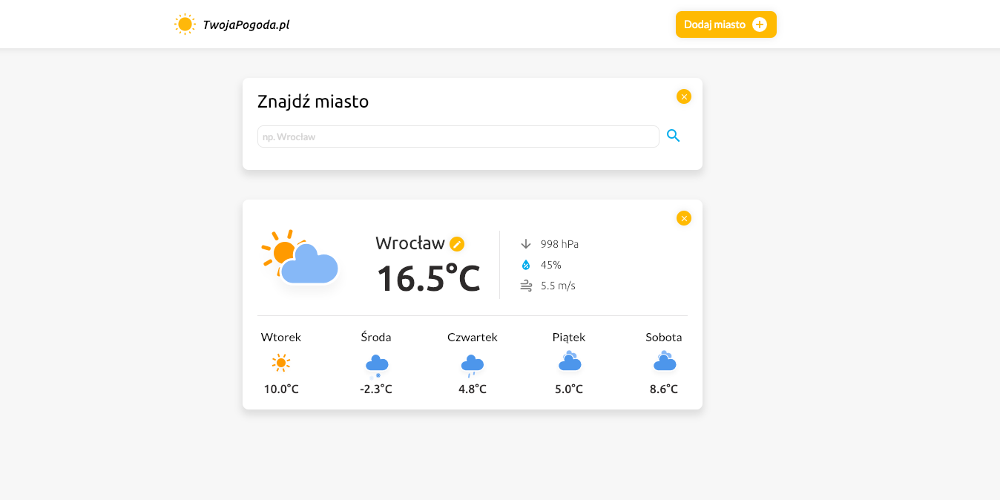
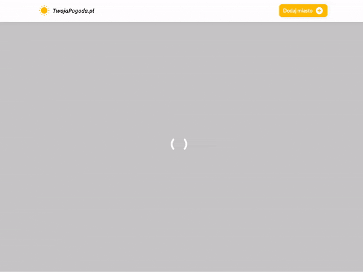
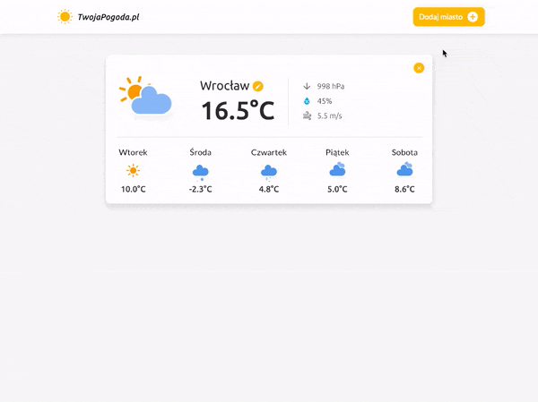

# Projekt - Weather App

Aplikacja pogodowa, która wyświetla aktualną pogodę i prognozę na 5 dni w przód dla wybranych miast.



### Struktura projektu:

```
css
  -- style.css (plik ze stylami)
js
  app.js (plik główny)

assets
  -- icons (ikony dla projektu)

index.html (plik główny aplikacji)
```


## Założenia
W aplikacji mamy możliwość odnalezienia współrzędnych konkretnego miejsca i na podstawie tych danych, wyświetlić aktualną i prognozowaną pogodę. Wyświetlamy wszystkie niezbędne informacje:

- Aktualna temperatura
- Wilgotność
- Ciśnienie
- Prędkość wiatru
- Prognoza pogody na 5 dni w przód

## Zasady działania

### Wejście na stronę
Po wejściu na stronę wysyłamy zapytanie do `Weather API` aby pobrać pogodę dla naszej aktualnej lokalizacji i wyświetlić ją użytkownikowi.




### Dodanie nowego miasta
Na stronie znajduje się przycisk "Dodaj miasto". Po jego kliknięciu wyświetla się ukryta sekcja z formularzem. Po wpisaniu przez użytkownika miasta czy całego adresu wykonuje się zapytanie do `Weather API`, aby pobrać aktualną pogodę i wyświetlić ją użytkownikowi.




### Ukrywanie/Usuwanie modułu
Po kliknięciu przycisku "x" w prawym górnym rogu każdego modułu możemy go ukryć


## API

### Weather API

**Wymagany jest klucz API!**

API odpowiedzialne za dostarczenie nam aktualnej i prognozowanej pogody.

Należy się zarejestrować, **wygenerować swój klucz** i zapisać go w projekcie.

Pobranie klucza: [https://www.weatherapi.com](https://www.weatherapi.com)  

Pobranie aktualnej pogody i prognozy na 5 dni: 

```
http://api.weatherapi.com/v1/forecast.json?key=twoj_klucz&q=nazwa_miasta_lub_auto:ip&days=5
```
